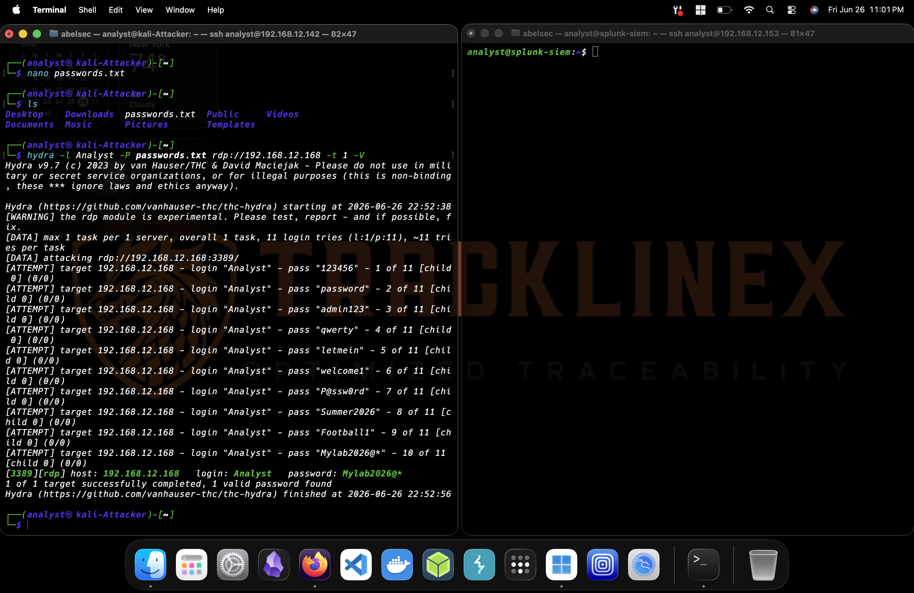
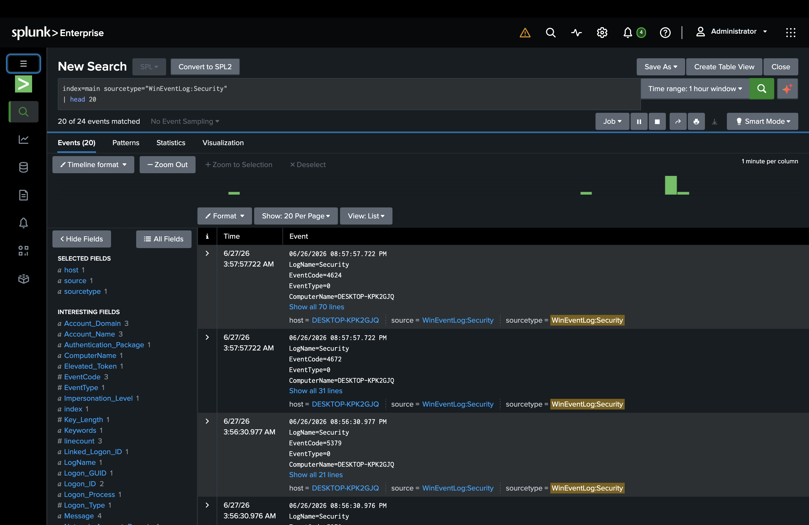
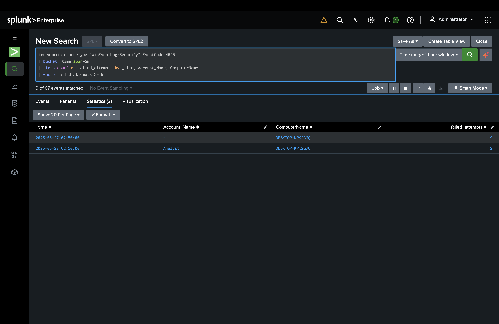
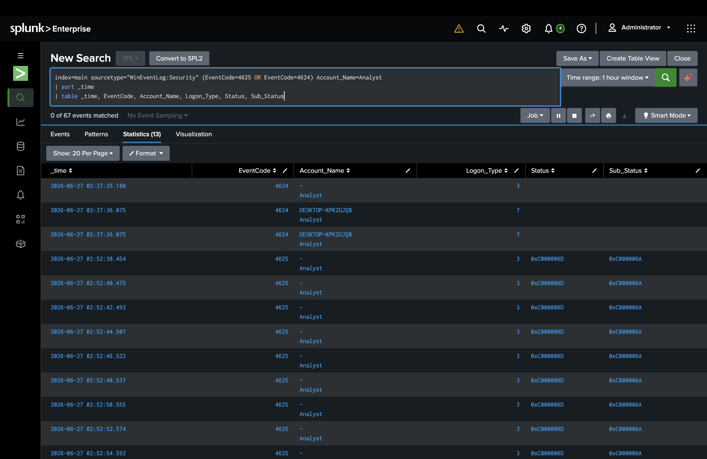
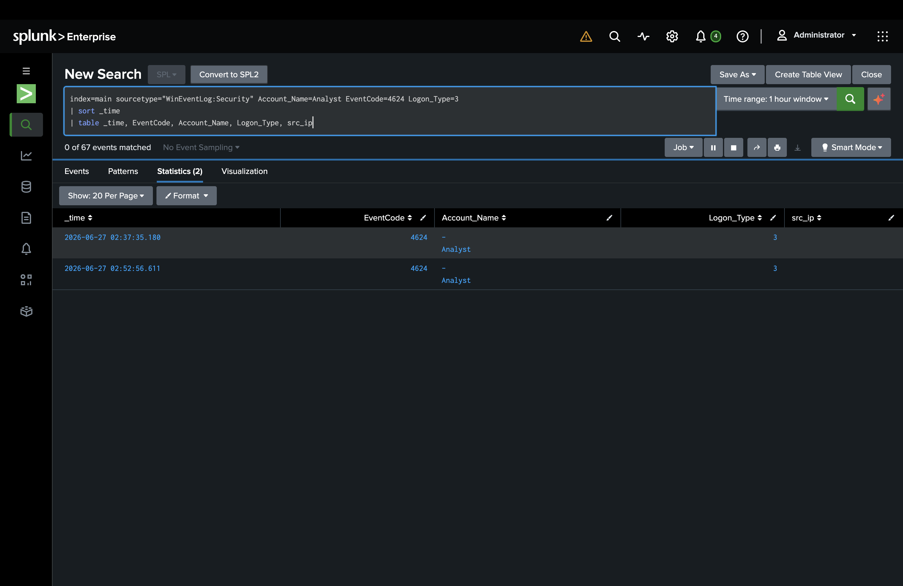
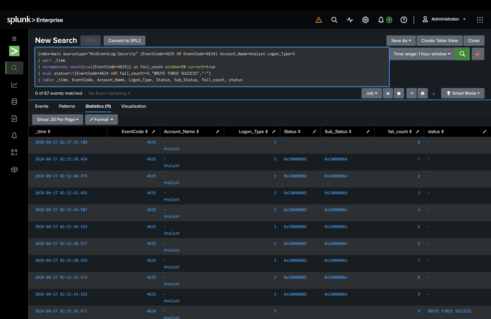

# Brute Force Attack Analysis — RDP (Real Lab Capture)

This case replaces the earlier theoretical brute force write-up with a fully reproduced attack, executed and captured end-to-end in my own home SOC lab — not a simulated/theoretical scenario.

## Scenario

A brute force attack was launched from a Kali Linux attack host against the RDP service (port 3389) of a Windows 10 endpoint within the lab, using Hydra with a custom password list. The goal was to validate the full detection pipeline — from attack execution, to log generation, to SIEM-based detection — using real traffic generated on infrastructure I built and control.



```
hydra -l Analyst -P passwords.txt rdp://192.168.12.168 -t 1 -V
```

**Result:** 9 failed login attempts followed by 1 successful login (the correct password was placed last in the wordlist, to produce a controlled, observable compromise). Total attack duration: ~18 seconds.

## Investigation

Before the attack, I confirmed that Windows was auditing logons (`auditpol /get /subcategory:"Logon"` → Success and Failure already enabled), but Splunk's Universal Forwarder was only ingesting Sysmon, not the Windows Security log. I added the missing `inputs.conf` stanza for `WinEventLog://Security` and restarted the forwarder.



With the Security log flowing into Splunk, I queried for clustered failed logons:

```spl
index=main sourcetype="WinEventLog:Security" EventCode=4625 Logon_Type=3
| bin _time span=1m
| stats count as failed_logons by _time, Account_Name
| where failed_logons >= 5
```



This returned 9 failed logons for the `Analyst` account inside a single 1-minute window — well past the 5-attempt threshold I set.

Drilling into the individual events showed each failure carrying `Status=0xC000006D` / `Sub_Status=0xC000006A`:



That status code combination specifically means **"valid account name, incorrect password"** — meaning the attacker already had a confirmed valid username and was only guessing credentials, as opposed to a broader unauthenticated scan. That's a meaningful triage detail.

I then confirmed the successful logon that closed out the attack:



## Findings

- **Event IDs:** 4625 (failure) ×9, 4624 (success) ×1
- **Logon Type:** 3 (Network Logon) — consistent with RDP
- **Status/Sub-Status:** `0xC000006D` / `0xC000006A` — valid username, wrong password
- **Timing:** 9 failures across ~16 seconds, success on the 10th attempt
- **Indicators:** High-frequency repeated attempts against a single account, automated tooling signature (consistent intervals, no human-typing variance)

To confirm the detection logic actually correlates the failure spike with the resulting compromise (not just counts failures in isolation), I ran:

```spl
index=main sourcetype="WinEventLog:Security" (EventCode=4625 OR EventCode=4624) Account_Name=Analyst Logon_Type=3
| sort _time
| streamstats count(eval(EventCode=4625)) as fail_count window=20 current=true
| eval status=if(EventCode=4624 AND fail_count>=5,"BRUTE FORCE SUCCESS","-")
| table _time, EventCode, Account_Name, Logon_Type, Status, Sub_Status, fail_count, status
```



`fail_count` climbed from 0 to 9 across the failed attempts, and the resulting successful logon was correctly flagged `BRUTE FORCE SUCCESS` — confirming the rule ties the failure spike to the actual moment of compromise, not just an isolated count.

## Conclusion

This activity is a confirmed (self-executed) brute force attack that successfully compromised the `Analyst` account via RDP in approximately 18 seconds. The detection logic built and validated here correctly identifies both the attack pattern (failure spike) and the outcome (successful compromise immediately following it) — the two signals a SOC analyst needs to distinguish a noisy-but-failed attack from an active breach.

## Mitigation

- Enforce account lockout policy after a small number of failed attempts
- Require MFA on RDP, or disable direct RDP exposure in favor of a VPN/RDP gateway
- Alert specifically on a **successful** logon immediately following a failure spike — this is the highest-fidelity signal of compromise, not just the failures alone
- Cross-reference source IP against threat intel for any internet-facing RDP
- Enforce strong password policy to reduce dictionary-attack success rate

## SOC Context

In a live SOC, this pattern would trigger a high-severity alert specifically because the failure spike was followed by a success — that combination should auto-escalate past Tier 1 triage and into active incident response (potential account compromise), rather than be treated as a routine failed-login alert. A Tier 1 analyst would validate the successful logon's legitimacy (was it the actual account owner, from an expected source?) and, if not, immediately initiate containment (disable the account, terminate active sessions, begin a fuller investigation of attacker activity post-compromise).

---

*This case was built using my own [SOC home lab](https://github.com/4belSec/soc-home-lab) — see that repo for full lab architecture and setup.*
